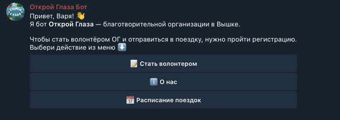
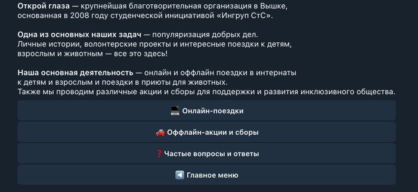
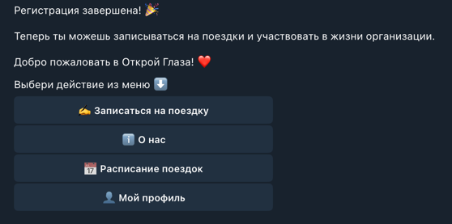
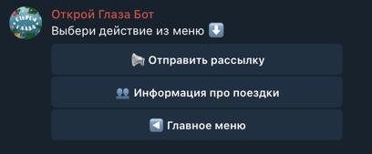

# Telegram-бот волонтерской организации Открой Глаза

Telegram-бот для автоматизации работы с волонтерами благотворительной организации НИУ ВШЭ "Открой Глаза".
Бот помогает новым волонтерам пройти регистрацию, записаться на поездки в детские интернаты и приюты для животных, а
администраторам — управлять мероприятиями.

## Основные возможности

### Для волонтеров

- **Регистрация**: многошаговый процесс сбора информации (ФИО, телефон, факультет, станция метро, интересующие
  направления)
- **Управление профилем**: просмотр и редактирование личных данных
- **Запись на мероприятия**: просмотр расписания предстоящих поездок и онлайн-встреч, регистрация/отмена записи
- **Информационный раздел**: FAQ, описание деятельности организации, типов мероприятий

### Для администраторов

- **Управление мероприятиями**: автоматическая синхронизация расписания из Google Sheets
- **Просмотр списков**: получение списка записавшихся на каждое мероприятие
- **Рассылка**: отправка уведомлений всем зарегистрированным волонтерам

## Архитектура

```
├── main.py                # Точка входа, инициализация бота
├── config.py              # Конфигурация
├── states.py              # Определение состояний FSM
├── sheets_service.py      # Сервис работы с Google Sheets
├── keyboards.py           # Клавиатуры для интерфейса
└── handlers/
    ├── start.py          # Главное меню, базовые команды
    ├── registration.py   # Процесс регистрации и редактирования
    ├── events.py         # Работа с мероприятиями
    ├── info.py           # Информационные разделы
    └── admin.py          # Админ-панель
```

## Интеграция с Google Sheets

Бот использует Google Sheets как базу данных для хранения:

- **Лист questions**: данные зарегистрированных волонтеров (дата регистрации, id, username, фио, телефон,
  факультет и ОП, метро, треки, ожидание, предпочтения)
- **Лист activity**: матрица записей на мероприятия (волонтеры × события)
- **Лист schedule**: расписание и статус предстоящих поездок и онлайн-встреч

Для работы требуется файл с credentials от Google Cloud Service Account.

## Основные функции

### Регистрация пользователя

```python
# Многошаговая FSM-логика с валидацией на каждом шаге
RegistrationStates:
- waiting_for_full_name
- waiting_for_phone
- waiting_for_faculty
- waiting_for_metro
- waiting_for_tracks  # Множественный выбор
- waiting_for_activities  # Множественный выбор
- waiting_for_expectations
- confirming  # Подтверждение данных
```

### Работа с мероприятиями

- Динамическая генерация клавиатур на основе данных из Google Sheets
- Проверка статуса записи пользователя перед отображением
- Атомарное обновление статуса регистрации

### Паттерны проектирования

- **Singleton** — для `SheetsService` (единственный экземпляр для всех запросов)
- **FSM** — для управления состояниями многошаговых диалогов
- **Router** — разделение обработчиков по модулям

## Примеры использования

### Для нового волонтера

1. `/start` — запуск бота



2. "ℹ️ О нас" — просмотр основной информации об организации



3. "📝 Стать волонтером" — начало регистрации
4. Заполнение всех полей анкеты
5. Подтверждение данных



6. "📅 Расписание поездок" — просмотр расписания
7. "✍️ Записаться на поездку" — запись на мероприятие
8. "👤 Мой профиль" — контактные данные волонтера

### Для администратора

1. `/admin` — открытие админ-панели



2. "👥 Информация про поездки" — выбор события → список участников
3. "📢 Отправить рассылку" — ввод текста → отправка всем

## Особенности реализации

- Все текстовые данные хранятся в Google Sheets
- Inline-клавиатуры с callback-запросами для улучшения UX
- Обработка состояния "редактирования" через флаг `is_changing` в FSM-данных
- Множественный выбор через динамические клавиатуры с чекмарками (✅)
- Fallback-обработка для кнопок "Назад" и "Отменить" на каждом шаге
